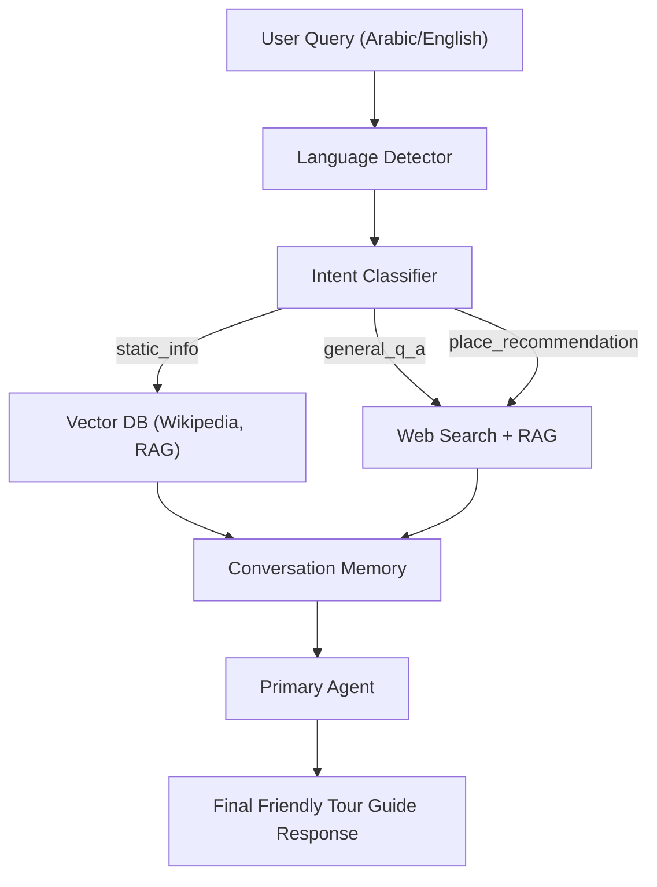

# 🏔️ Ifrane AI Tour Guide Assistant  
## Overview 
This project is a **bilingual (Arabic/English) HTTP agentic service** that acts as a **virtual tour guide for Ifrane, Morocco**.  

- **Static facts** (e.g., history, landmarks, nature) → scraped once from Wikipedia and stored in a **vector database (ChromaDB)**, enabling fast and reliable **RAG (Retrieval-Augmented Generation)** instead of searching each time.  
- **Dynamic info** (e.g., hotel prices, restaurant options, events) → fetched on-demand via **web search tools**.  
- **Agent Orchestration** → detects intent, plans tool usage, and generates answers in a **warm, tour-guide tone**.  
- **Bilingual** → auto-detects input language (Arabic/English) and replies accordingly.

## Features  

-  **Bilingual Support** – English & Arabic auto-detected.  
-  **Static Knowledge via RAG** – Wikipedia scraping → ChromaDB → vector search.  
-  **Dynamic Knowledge via Web Search** – For up-to-date info (prices, hotels, dining).  
-  **Intent Detection** – Classifies queries as:  
  - `static_info` → history, landmarks.  
  - `general_q_a` → best time, culture, safety, transport.  
  - `place_recommendation` → where to eat/stay/visit.  
-  **Quality Assurance Layer** – Checks and refines answers before returning.
-  **Conversation Memory** – Keeps track of past user queries to provide coherent, contextual answers.    
-  **Containerized** – Runs inside Docker.

##  Architecture 
The system is built around an **agentic workflow implemented with LangGraph**.  

Here’s how the flow works step by step:  
1. **User query** is received in either Arabic or English.  
2. **Language Detector** identifies the input language.  
3. **Intent Classifier** determines whether the user is asking about static info, general Q&A, or place recommendations.  
4. Based on intent:  
   - **Static info** → Retrieved from the **vector database (ChromaDB)** using RAG.  
   - **General Q&A / Recommendations** → Trigger a **web search tool**, then optionally enrich with vector DB results.  
5. **Conversation Memory** ensures the assistant remembers past interactions so users can continue seamlessly.  
6. **Quality Assurance Agent** reviews the response for clarity and consistency.  
7. **Final Answer** is generated in a **tour guide style**, in the same language as the query.  
### Graph Representation  



##  Tech Stack  

- *Python 3.10+*  
- *Flask* – HTTP API server  
- *ChromaDB* – Vector store for static Ifrane knowledge  
- *HuggingFace Embeddings* – all-MiniLM-L6-v2  
- *DuckDuckGo Search* – Dynamic info retrieval  
- *LangGraph-style orchestration* – Agent flow  
- *Docker* – Deployment

##  Installation & Setup  

### 1. Clone Repo  
```bash
git clone https://github.com/zainabjamalm/ifrane-tour-guide.git
cd ifrane-tour-guide
```
### 2. Install Dependencies
Make sure you have Python 3.10+ and pip installed, then run:
```bash
pip install -r requirements.txt
```
### 3. Environment Variables
Create a .env file in the root directory and add
```bash
GOOGLE_API_KEY =Your API Key
PERSIST_DIRECTORY=./ifrane_vector_db
```
### 4. Run Locally
```bash
python app.py
```
### 5. Run with Docker
```bash
docker build -t ifrane-guide .
docker run -p 5000:5000 ifrane-guide
```
## API Usage

## Project Structure    

```plaintext
.
├── app.py                  # Main Flask + agent orchestration
├── knowledge_base/         # Wikipedia scraping + vector DB setup
├── tools/                  # Tool definitions (web search, RAG)
├── agents.py               # LangGraph orchestration
├── ifrane_vector_db/       # Persisted Chroma vector DB
├── Dockerfile              # Containerization
├── requirements.txt        # Dependencies
└── README.md               # Documentation
```


 


